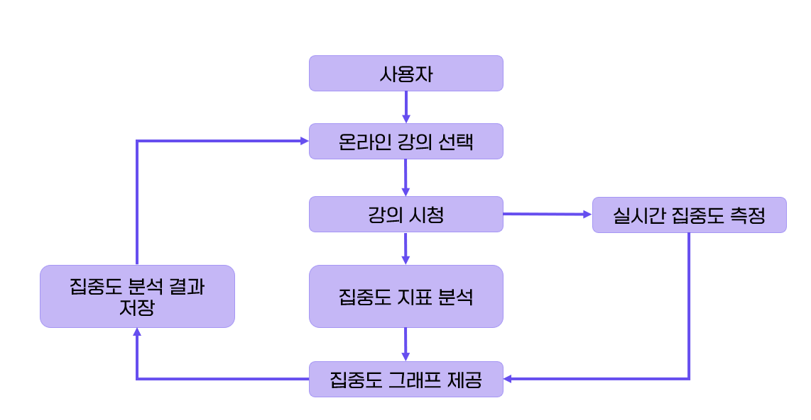
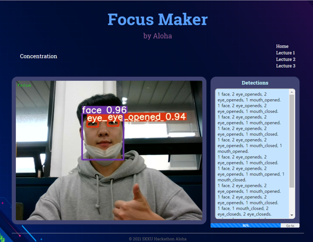
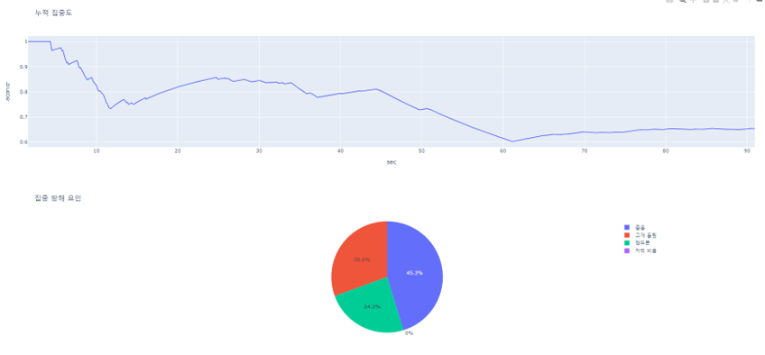

# 2021 SKKU Hackathon - FocusMaker

### 온라인 학습자 집중도 지표 측정 및 자가 피드백 서비스

<br>

## 집중도 측정 지표
1. Focus
2. Phone
3. Sleep
4. Looking Side (Right or Left)
5. No Face Detection

<br>

## 서비스 구성도



<br>

## Prototype



<br>

## 결과 및 분석 제공

- 시간별 집중도 : 20 프레임 전부터 현재까지 가중 이동 평균으로 현재 집중도를 계산
- 누적 집중도 : 전체 프레임에서 집중한 프레임의 비율을 계산
- 집중 방해 요인 : 집중하지 않은 프레임의 요인을 분석
- 시간 분석 : 전체 시간의 해당 항목을 분석

<br>

## Usage

1. 얼굴 인식을 위한 얼굴 인식 가중치를 다운로드 - [Click Here](https://drive.google.com/file/d/1m6eOs6lGYVKuJS9GWVuuTlbXb_X62Oee/view?usp=sharing)

2. ```pip install -r requirements.txt```
패키지 설치

  

3. ```detect.py```
localhost 접속 후 집중도 측정 시작

  
